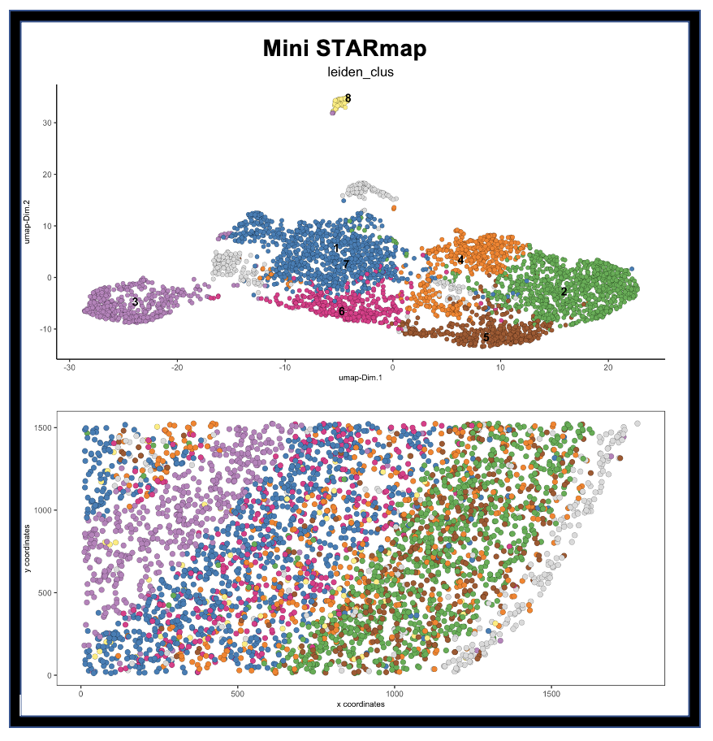
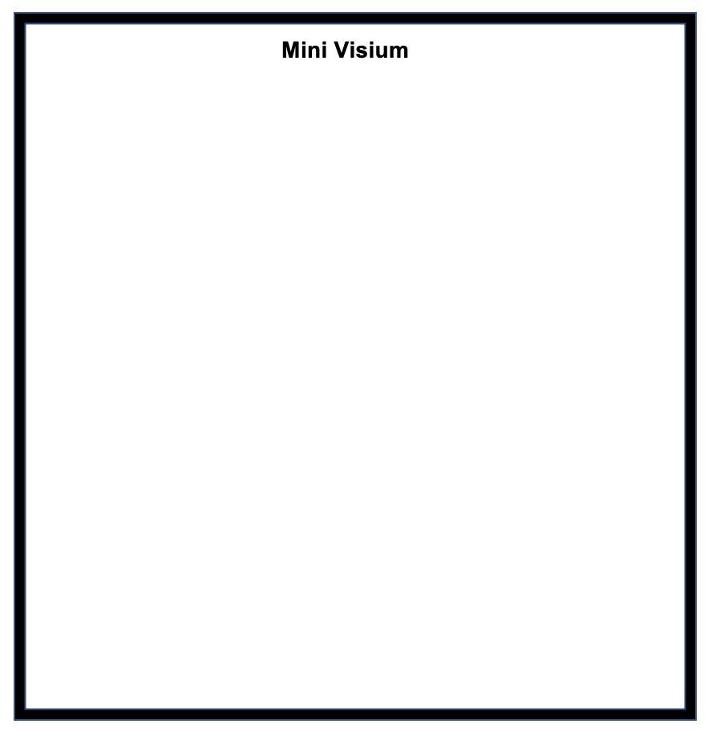

**DATASETS: WORK IN PROGRESS**

See `Spatial Datasets <https://github.com/RubD/spatial-datasets>`_ to find raw and pre-processed input data and Giotto scripts (*work in progress*).

The typical run time range for the different datasets on a personal computer is around 10~45 minutes. 
All of the examples are gradually updated to the latest Giotto version! You can click on the imagees below to try out some of the example datasets. 

##################################
Mini Datasets
##################################

.. toctree::
	:maxdepth: 2
    :caption: Mini Datasets
    :hidden:

	Mini SeqFISH </subsections/datasets/mini_seqFISH.rst>
    Mini Visium </subsections/datasets/mini_visium.rst>
    Mini 3D STARmap </subsections/datasets/mini_3D_STARmap.rst>

.. panels::
    :body: text-center
    :container: container-md pb-4
    :column: col-lg-4 col-md-4 col-sm-6 col-xs-12 p-2

    .. image:: images/dataset_page/mini_seqFISH.png
        :target: ../../build/html/subsections/datasets/mini_visium.html

    .. link-button:: /subsections/datasets/seqFISH_cortex.rst
        :type: ref
        :text: Mini SeqFish
        :classes: btn-outline-primary btn-block stretched-link
    
    ---

    .. image:: images/dataset_page/mini_STARmap.png
        :target: ../../build/html/subsections/datasets/mini_visium.html

    .. link-button:: subsections/datasets/human_CyCIF_PDAC.rst
        :type: ref
        :text: Mini STARmap
        :classes: btn-outline-primary btn-block stretched-link
    
    ---
    
    .. image:: images/dataset_page/mini_visium.png
        :target: ../../build/html/subsections/datasets/mini_visium.html

    .. link-button:: ../../build/html/subsections/datasets/mini_visium.html
        :type: ref
        :text: Mini Visium
        :classes: btn-outline-primary btn-block stretched-link 

|miniseqFISH|  |miniSTAR|   |minivisium|

##################################
Full Datasets
##################################
                    
.. toctree::
    :maxdepth: 2
    :caption: Full Datasets
    :hidden:

	Mouse seqFISH Cortex </subsections/datasets/seqFISH_cortex.rst>
    Mouse merFISH Hypoth. Preopt. Region </subsections/datasets/mini_visium.rst>
    Mouse STARmap Cortex </subsections/datasets/mini_3D_STARmap.rst>
	Mouse Visium Brain </subsections/datasets/mini_3D_STARmap.rst> 
	Mouse Visium Kidney </subsections/datasets/mini_3D_STARmap.rst>
	Mouse CODEX Spleen </subsections/datasets/mini_3D_STARmap.rst>
	Mouse osmFISH SScortex </subsections/datasets/mini_3D_STARmap.rst>
	Human CyCIF PDAC </subsections/datasets/mini_3D_STARmap.rst>
	

.. panels::
    :body: text-center
    :container: container-md pb-3
    :column: col-lg-4 col-md-4 col-sm-6 col-xs-12 p-2

    .. image:: images/dataset_page/mini_seqFISH.png

    .. link-button:: /subsections/datasets/mini_seqFISH.rst
        :type: ref
        :text: Mini SeqFish
        :classes: btn-outline-primary btn-block stretched-link
    
    ---

    .. image:: images/dataset_page/mini_STARmap.png

    .. link-button:: subsections/datasets/mini_3D_STARmap.rst
        :type: ref
        :text: Mini STARmap
        :classes: btn-outline-primary btn-block stretched-link
    
    ---
    
    .. image:: images/dataset_page/mini_visium.png

    .. link-button:: ../build/html/subsections/datasets/mini_visium.html
        :type: ref
        :text: Mini Visium
        :classes: btn-outline-primary btn-block stretched-link 